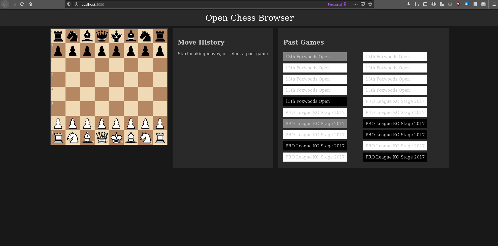

# OCB

A repo containing sub-modules which together make up the code for the open chess browser

## Screenshots

## Project Aim

The aim of this project was for the most part:

 - Learn About Graph Databases
 - Learn About WASM
 - Learn/Practice Rust

Note: The goals of this project is not to be functional, or a replacement for any of the wonderful chess tools out there. I just really enjoy chess, and wanted to try some new technologies that I'm excited about. Any attempt to use this seriously will not be successful (at least for now - I may slowly add features over time).

## Setup of Submodules

To get started recursively clone:

	$ git clone --recurse-submodules git@github.com:etopiei/OCB.git

This will clone all the parts of this project to a local folder called OCB.

## Development

Honestly this is not super easy to set-up yet. Work will be done in future to make this easier.

There are a few necessary dependencies:

 - python3
 - neo4j server
 - rust + cargo
 - wasm-pack

Then to get going:

1. Import PGN file(s) into the neo4j server with 'dbbuilder' (more detailed instructions will be in that repo) This will act as the game database.

2. Open a new terminal and start the 'chessgraphserver' (instructions included in that repo) This will take requests from the front-end and process them and return results from the neo4j database.

3. Build the front-end WASM in 'openchessbrowser' with:

	$ wasm-pack build

4. Run the frontend from 'openchessbrowser' with:

	$ cd www
	$ npm run start
